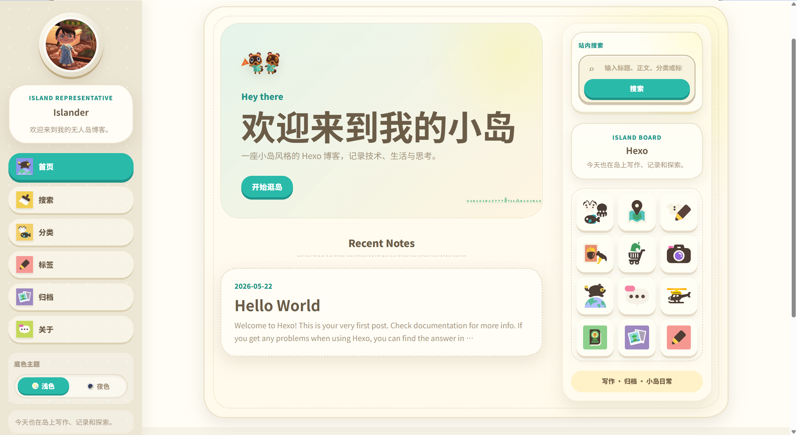

# 🏝️ Hexo Theme Animal Island

<p align="center">
  <strong>English</strong> · <a href="./README.zh-CN.md">简体中文</a>
</p>

<p align="center">
  🍃 A cozy island-style Hexo theme with paper cards, soft colors, day/night mode, and a tiny island UI mood.
</p>

<p align="center">
  <strong>Hexo >= 6</strong> · <strong>Node.js >= 16</strong> · <strong>Source-available / Non-commercial only</strong>
</p>

---

## ⚠️ Legal Notice

This project is provided only for **personal learning, research, and non-commercial demonstration**. Commercial use, resale, paid redistribution, or use in commercial services is prohibited.

UI elements, visual tokens, and selected assets are credited to [animal-island-ui](https://github.com/guokaigdg/animal-island-ui) by guokaigdg and other sources listed in [CREDITS.txt](./CREDITS.txt) and [docs/ASSETS_AND_CREDITS.md](./docs/ASSETS_AND_CREDITS.md). They are not provided by Nintendo.

This project is **not** an official Nintendo product, is **not** endorsed by Nintendo, and is **not** affiliated with Nintendo. Users are responsible for their own use. See [LEGAL_NOTICE.md](./LEGAL_NOTICE.md) and [LICENSE](./LICENSE).

## 🌊 Demo

- 🏖️ [Online preview](https://hexo-theme-animal-island-demo.pages.dev)



## 🌿 Features

- 🏡 Native Hexo theme structure: `layout/`, `source/`, and `_config.yml`.
- 📱 Responsive sidebar, mobile drawer menu, profile card, navigation icons, and decorative right rail.
- 🌗 Built-in `day` / `night` theme switch stored in `localStorage`.
- 🔎 Client-side site search for post titles, content, categories, and tags.
- 🧭 Category and tag overview pages rendered from Hexo collections.
- 📚 Sticky post table of contents generated from rendered article headings.
- 🧩 Configurable profile, hero area, menu, labels, side board, footer links, images, and TOC behavior.
- 🖱️ Unified custom cursor for links, buttons, and form controls.
- 🧪 Lightweight validation script for release checks.

## 📦 Installation

Clone the theme into your Hexo site's `themes/` directory:

```bash
cd /path/to/your-hexo-site
mkdir -p themes
git clone https://github.com/timoforge/hexo-theme-animal-island.git themes/animal-island
```

Enable the theme in the Hexo site root `_config.yml`:

```yaml
theme: animal-island
```

Copy the example override configuration to the Hexo site root:

```bash
cp themes/animal-island/examples/_config.animal-island.yml _config.animal-island.yml
```

Generate the site:

```bash
hexo clean && hexo generate
```

> If you rename the theme folder, the `theme:` value must match the folder name. The override file name must match as well, for example `_config.<theme-name>.yml`.

## 🗺️ Recommended Pages

The default menu points to search, categories, tags, archives, and about pages. Archives are built in by Hexo, but the other pages should be created in your Hexo site:

```bash
hexo new page search
hexo new page categories
hexo new page tags
hexo new page about
```

Set the page front matter:

```yaml
# source/search/index.md
---
title: Search
type: search
---
```

```yaml
# source/categories/index.md
---
title: Categories
type: categories
---
```

```yaml
# source/tags/index.md
---
title: Tags
type: tags
---
```

## ⚙️ Configuration

Theme defaults live in this repository:

```text
_config.yml
```

For real sites, keep custom values in the Hexo site root override file:

```text
_config.animal-island.yml
```

Minimal example:

```yaml
profile:
  avatar: /images/island-assets/profile.jpg
  name: "Islander"
  intro: "Welcome to my island blog."
  status: "Writing, building, and exploring today."

hero:
  title: "Welcome to my island"
  subtitle: "A cozy island-style Hexo blog."
  cta_text: "Explore archives"
  cta_url: /archives/

toc:
  enable: true
  min_depth: 2
  max_depth: 4

links:
  - name: GitHub
    url: https://github.com/timoforge/hexo-theme-animal-island
  - name: RSS
    url: ""
```

See the complete example in [examples/_config.animal-island.yml](./examples/_config.animal-island.yml) and the full guide in [docs/CONFIGURATION.md](./docs/CONFIGURATION.md).

## 📚 Post TOC

The post TOC is enabled by default and reads headings from rendered post content.

Disable it for one post:

```yaml
---
title: My post
toc: false
---
```

Override heading depth for one post:

```yaml
---
title: My post
toc:
  min_depth: 2
  max_depth: 3
toc_title: "On this page"
---
```

## 🌗 Theme Switching

Theme buttons use:

```html
data-theme-choice="day" data-theme-choice="night"
```

The browser storage key is:

```text
animal-island-theme
```

Supported values are `day` and `night`. The value is written to `html[data-theme]` before CSS loads to reduce refresh flicker.

## 🧰 Development

Run the built-in validation script before publishing changes:

```bash
npm run validate
```

Validate inside a real Hexo site as well:

```bash
cd /path/to/your-hexo-site
hexo clean && hexo generate
```

There is no separate test suite or lint script in this theme package. The validation script checks required files, CSS asset references, JavaScript syntax, EJS tags, theme/cursor conventions, image references, and release-safety wording.

## 🧾 Documentation

- 📦 [Installation](./docs/INSTALLATION.md)
- ⚙️ [Configuration](./docs/CONFIGURATION.md)
- 🎨 [Customization](./docs/CUSTOMIZATION.md)
- 🧰 [Development](./docs/DEVELOPMENT.md)
- 🏗️ [Project structure](./docs/STRUCTURE.md)
- 🗒️ [Project manual](./docs/PROJECT_MANUAL.md)
- 🩹 [Troubleshooting](./docs/TROUBLESHOOTING.md)
- 🙏 [Assets and credits](./docs/ASSETS_AND_CREDITS.md)
- ⚠️ [Legal notice and usage restrictions](./LEGAL_NOTICE.md)

## 🌱 References

- [animal-island-ui](https://github.com/guokaigdg/animal-island-ui) by guokaigdg — UI elements, visual tokens, and selected island-style assets.
- [ac-site-template](https://github.com/yunxinz/ac-site-template) by Zhang Yunxin / yunxinz — layout atmosphere and decorative asset references.
- Full credits and usage notes: [docs/ASSETS_AND_CREDITS.md](./docs/ASSETS_AND_CREDITS.md).

## 🚢 Publishing Checklist

Before publishing this theme on GitHub:

- [ ] Run `npm run validate`.
- [ ] Test `hexo clean && hexo generate` in at least one Hexo site.
- [ ] Keep `README.md` and `README.zh-CN.md` in sync.
- [ ] Keep `LICENSE`, `LEGAL_NOTICE.md`, `CREDITS.txt`, and `docs/ASSETS_AND_CREDITS.md`.
- [ ] Keep the personal-learning-only and non-commercial restrictions visible.

## 📜 License

This project is source-available for personal learning and non-commercial use only. Commercial use is prohibited. See [LICENSE](./LICENSE) and [LEGAL_NOTICE.md](./LEGAL_NOTICE.md).

Third-party UI elements, references, and asset credits are listed in [CREDITS.txt](./CREDITS.txt) and [docs/ASSETS_AND_CREDITS.md](./docs/ASSETS_AND_CREDITS.md). Keep these notices when copying, modifying, or publicly sharing this theme.
